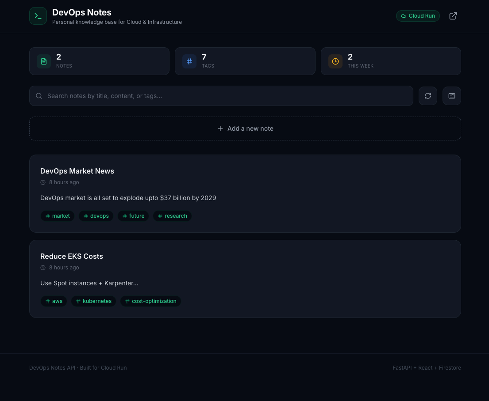

# DevOps Notes API

A lightweight, serverless full-stack application for DevOps engineers to store, search, and manage personal notes, tips, and learnings. Built with **FastAPI** + **React** + **Firestore** and deployed on **Google Cloud Run**.

## DevOps Notes UI Preview



## Features

- Create, read, update, search, and delete DevOps notes
- Markdown support with code syntax highlighting
- Tag-based filtering and full-text search
- Firestore as backend database
- Fully containerized with Docker (backend + frontend)
- Infrastructure as Code with Terraform
- Automated CI/CD with Cloud Build
- Serverless & auto-scaling on Cloud Run

## Tech Stack

| Layer | Technology |
|-------|------------|
| **Frontend** | React 18, TypeScript, Vite, Tailwind CSS, Framer Motion |
| **Backend** | Python 3.11, FastAPI, Pydantic |
| **Database** | Google Cloud Firestore (Native mode) |
| **Container** | Docker, Docker Compose |
| **Deployment** | Google Cloud Run |
| **IaC** | Terraform |
| **CI/CD** | Google Cloud Build |

## Architecture

```
┌─────────────────┐     ┌─────────────────┐     ┌─────────────────┐
│     User        │────▶│  Cloud Run      │────▶│   Firestore     │
│   (Browser)     │◄────│  (Frontend)     │     │   Database      │
└─────────────────┘     └────────┬────────┘     └─────────────────┘
                                 │
                                 │ HTTPS / JSON
                                 ▼
                        ┌─────────────────┐
                        │  Cloud Run      │
                        │  (Backend API)  │
                        └─────────────────┘
                                 │
                                 ▼
                        ┌─────────────────┐
                        │  Artifact       │
                        │  Registry       │
                        └─────────────────┘
                                 ▲
                                 │ Build & Push
                                 │
                        ┌─────────────────┐
                        │  Cloud Build    │◄──── Git Push (main)
                        │  (CI/CD)        │
                        └─────────────────┘
```

**Request Flow:**
1. User opens the React frontend served from Cloud Run
2. Frontend makes API calls to the FastAPI backend (also on Cloud Run)
3. Backend reads/writes notes to Firestore
4. Git push to `main` triggers Cloud Build → builds both images → deploys

## Prerequisites

1. Google Cloud Account + Project
2. `gcloud` CLI installed and authenticated
3. Terraform installed (for IaC)
4. Docker + Docker Compose installed (for local container development)

## Quick Start

### Option 1: Local Development

```bash
# Clone the repository
git clone https://github.com/sumitNITS/devops-notes-api.git
cd devops-notes-api

# Make sure you have GCP credentials for Firestore access
gcloud auth application-default login
```

**Backend:**
```bash
# Create and activate virtual environment
python3 -m venv venv
source venv/bin/activate

# Install dependencies
pip install -r requirements.txt

# Enable Firestore API
gcloud services enable firestore.googleapis.com

# Setup Firestore authentication
gcloud auth application-default login

# Create Firestore database (if not already created)
gcloud firestore databases create --database="devops-notes-db" --location=asia-south1

# Run the application
cd app
uvicorn main:app --reload --port 8000
```

**Frontend:**
```bash
cd frontend

# Install dependencies
npm install

# Create environment file
cp .env.example .env

# Start Vite dev server (runs on port 5173)
npm run dev
```

Open:
- **Frontend UI:** http://localhost:5173
- **Backend API:** http://localhost:8000
- **API Docs (Swagger):** http://localhost:8000/docs

**Test the API:**
```bash
# Health check
curl http://127.0.0.1:8000/health

# List notes
curl http://127.0.0.1:8000/notes

# Create a note
curl -X POST http://127.0.0.1:8000/notes \
  -H "Content-Type: application/json" \
  -d '{
    "title": "My First DevOps Note",
    "content": "Remember to always enable APIs before using them! 🔥",
    "tags": ["gcp", "firestore", "troubleshooting"]
  }'
```

---

### Option 2: Deploy to Cloud Run

**Automatic (Recommended):**
Push code to `main` branch → Cloud Build automatically builds and deploys both services.

## Understanding the Ports

| Context | What Runs | Port | How to Access |
|---------|-----------|------|---------------|
| `npm run dev` (local) | Vite dev server | 5173 | http://localhost:5173 |
| Docker (frontend) | Nginx | **8080** inside container | http://localhost:**5173** (mapped) |
| Docker (backend) | Uvicorn | **8080** inside container | http://localhost:**8000** (mapped) |
| Cloud Run | Nginx / Uvicorn | 8080 | Via Cloud Run URL |

> **Key point:** Inside Docker, both frontend and backend listen on **8080** (Cloud Run requirement). We map them to different **host ports** (`5173` and `8000`) to avoid conflicts.

## API Endpoints

| Method | Endpoint | Description |
|--------|----------|-------------|
| GET | `/health` | Health check |
| POST | `/notes` | Create note |
| GET | `/notes` | List notes (paginated) |
| GET | `/notes/{id}` | Get single note |
| PUT | `/notes/{id}` | Update note |
| DELETE | `/notes/{id}` | Delete note |
| GET | `/notes/search?q=eks` | Search notes |
| GET | `/notes/tag/{tag}` | Filter notes by tag |

## Environment Variables

### Backend

| Variable | Description | Default |
|----------|-------------|---------|
| `FIRESTORE_DB_NAME` | Firestore database name | `devops-notes-db` |
| `PORT` | Application port | `8080` |

### Frontend

| Variable | Description | Default |
|----------|-------------|---------|
| `VITE_API_URL` | Backend API base URL | `http://127.0.0.1:8000` |

## Troubleshooting

### Frontend shows blank page or 404 in Docker
Make sure the API URL was set correctly at build time:
```bash
docker build -f Dockerfile.frontend \
  --build-arg VITE_API_URL=http://localhost:8000 \
  -t devops-notes-frontend .
```

### Port 5173 is already in use
Change the host port mapping:
```bash
docker run -p 3000:8080 devops-notes-frontend
# Now access http://localhost:3000
```

### Docker: Frontend can't reach backend
When both run in Docker, `localhost` inside the frontend container refers to the container itself, not your machine. Use Docker Compose which handles networking automatically.

### Permission Denied for Firestore
```bash
# Grant necessary IAM role
gcloud projects add-iam-policy-binding YOUR_PROJECT_ID \
  --member=user:YOUR_EMAIL \
  --role=roles/datastore.owner
```

### Cloud Build fails
```bash
# Grant Cloud Build service account permissions
PROJECT_NUMBER=$(gcloud projects describe YOUR_PROJECT_ID --format='value(projectNumber)')
gcloud projects add-iam-policy-binding YOUR_PROJECT_ID \
  --member=serviceAccount:$PROJECT_NUMBER@cloudbuild.gserviceaccount.com \
  --role=roles/run.admin
```

### Local app can't connect to Firestore
```bash
# Ensure authentication is set up
gcloud auth application-default login

# Verify Firestore is enabled
gcloud services enable firestore.googleapis.com
```

## Contributing

1. Fork the repository
2. Create a feature branch (`git checkout -b feature/amazing-feature`)
3. Commit changes (`git commit -m 'Add amazing feature'`)
4. Push to branch (`git push origin feature/amazing-feature`)
5. Open a Pull Request

## License

This project is licensed under the MIT License - see LICENSE file for details.

## Support

For issues and questions, please open an issue on GitHub.
